# Chess AI

[](https://python.org)
[](https://pytorch.org)
[](https://flask.palletsprojects.com)
[](LICENSE)

Сверточная нейросеть (CNN), обученная на **миллионах шахматных позиций**. Веб-интерфейс с тёмной темой, историей ходов, переворотом доски и 4 уровнями сложности.

## Архитектура

```mermaid
flowchart LR
    A[Board State] --> B[Position Encoding]
    B --> C[CNN Model]
    
    subgraph CNN_Architecture[CNN Architecture]
        D[Conv Layer 1\n8×8, 256 filters] --> E[BatchNorm + ReLU]
        E --> F[Conv Layer 2\n8×8, 256 filters]
        F --> G[BatchNorm + ReLU]
        G --> H[Conv Layer 3\n8×8, 256 filters]
        H --> I[BatchNorm + ReLU]
        I --> J[Flatten]
        J --> K[Dense 1024]
        K --> L[Dense 512]
        L --> M[Output: 4096]
    end
    
    C --> CNN_Architecture
    M --> N[Move Prediction]
    N --> O[Top-K Move Selection]
    O --> P[Play Move]
```



## Возможности

- **CNN для оценки позиций** — 3-слойная сверточная сеть, обученная на миллионах партий
- **4 уровня сложности** — Easy / Medium / Hard / Extreme (разные обученные модели)
- **Тёмная тема** — Современный веб-интерфейс
- **Переворот доски** — Игра за чёрных с автоматическим AI за белых
- **Обучение на Kaggle** — Скрипт `for_kaggle.py` для бесплатного облачного обучения
- **История ходов** — Просмотр всех ходов с возможностью отката

## Структура проекта

```
chess_ai/
├── app.py                  # Flask веб-приложение
├── model.py                # CNN архитектура
├── ai_player.py            # Логика выбора хода AI
├── train.py                # Локальное обучение
├── for_kaggle.py           # Скрипт для обучения на Kaggle
├── data_loader.py          # Загрузчик шахматных данных
├── chess_model.pth         # Базовая обученная модель
├── model_easy.pth          # Модель лёгкого уровня
├── model_medium.pth        # Модель среднего уровня
├── model_hard.pth          # Модель сложного уровня
├── static/                 # CSS, JS, ресурсы
├── templates/              # HTML шаблоны
├── requirements.txt
└── README.md
```

## Установка

```bash
git clone https://github.com/HolSoul/chess_ai.git
cd chess_ai

python -m venv .venv
.venv\Scripts\activate  # Windows
source .venv/bin/activate  # macOS/Linux

pip install -r requirements.txt
```

## Использование

```bash
python app.py
```

Откройте [http://127.0.0.1:5000](http://127.0.0.1:5000) в браузере.

1. Выберите уровень сложности (Easy / Medium / Hard / Extreme)
2. Начните игру
3. Переворот доски для игры за чёрных
4. История ходов справа

### Обучение собственных моделей

**Локально:**
```bash
python train.py
```

**На Kaggle (бесплатный GPU):**
1. Зайдите на [Kaggle](https://www.kaggle.com/)
2. Создайте New Notebook
3. Скопируйте содержимое `for_kaggle.py`
4. Загрузите PGN датасет (поищите "Chess Games" на Kaggle)
5. Запустите → скачайте `.pth` файлы

## Tech Stack

- **Deep Learning**: PyTorch, NumPy
- **Chess Logic**: python-chess
- **Web Framework**: Flask
- **Frontend**: HTML5, CSS3, jQuery, Chessboard.js, Chess.js

## Лицензия

MIT License
